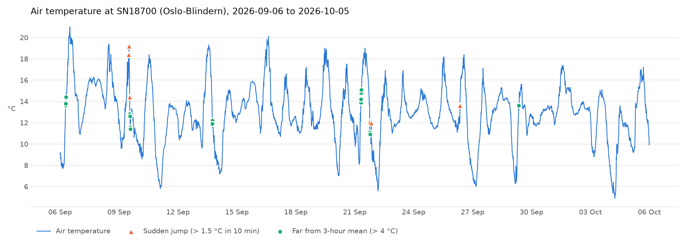

# frost-anomaly

A small Python program that fetches air temperature readings from the
[MET Norway Frost API](https://frost.met.no/) and flags gaps and anomalies in
the data.



For the last 30 days at one weather station (default: SN18700, Oslo-Blindern)
it finds:

- **Gaps** – periods where the station sent no data (more than 10 minutes
  between two readings).
- **Sudden jumps** – a change of more than 1.5 °C between two consecutive
  readings.
- **Deviations from the recent mean** – readings more than 4 °C away from the
  mean of the previous 3 hours.

The results are printed and drawn in `temperature.png`.

## Setup

Requires Python 3.11 or newer.

```bash
python3 -m venv .venv
source .venv/bin/activate
pip install -r requirements.txt
```

Get a free client ID at <https://frost.met.no/auth/requestCredentials.html>
and either set it as an environment variable:

```bash
export FROST_CLIENT_ID=your-client-id
```

or put it in a file called `client_id.txt` in the project folder. That file is
listed in `.gitignore`, so it is never committed.

## Usage

```bash
python main.py
```

To use another station or period, change `STATION` and `DAYS` in `main.py`.
Station IDs can be found through Frost's
[sources endpoint](https://frost.met.no/sources/v0.jsonld?types=SensorSystem&elements=air_temperature).

## Files

| File | Purpose |
|------|---------|
| `frost.py` | Fetches readings from Frost and returns a sorted list without duplicate times |
| `analysis.py` | `find_gaps`, `find_jumps` and `find_mean_deviations` |
| `plot.py` | Draws the chart with gaps and anomalies marked |
| `main.py` | Runs everything and prints the results |
| `test_analysis.py` | Tests for the analysis functions, using made-up data |

## Tests

```bash
python -m unittest
```

The tests use made-up readings, so they need neither network access nor a
client ID.
